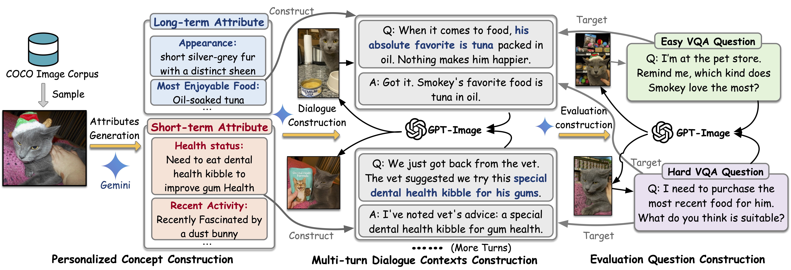

# LCMP & TAME

This repo provides official implementations for **LCMP & TAME**:

<div align="center">
<H2>TAMEing Long Contexts in Personalization:<br>Towards Training-Free and State-Aware MLLM Personalized Assistant<br>(KDD 2026 Research Track)</H2>
</div>

<div align="center">
  <a href="https://doi.org/10.1145/3770854.3780214">
    
  </a>
  <a href="https://arxiv.org/abs/2512.21616">
    
  </a>
</div>

# Overview

<div align="center">
<H2>
🔥 LCMP: A long-context MLLM personalization benchmark.</H2>
</div>




<div align="center">
<H4>
Construction pipeline of LCMP benchmark.
</H4>
</div>

<div align="center">
<H2>
🔥 TAME: A training-free, state-aware personalized MLLM assistant.</H2>
</div>


<div align="center">
<H4>
Architecture of TAME framework.
</H4>
</div>

# 🏗️ LCMP

LCMP is the first benchmark for evaluating **Long-Context MLLM Personalization**, which is more practical and conceptually different from existing static, single-turn visual-identification-oriented evaluation.

## LCMP Content

We will release the complete LCMP benchmark in `data/concept`, which includes personalized pets, people, and objects, along with their associated dialogues, questions, and personalized images.

## Construct LCMP

We also provide code to reproduce LCMP by adding more personalized concepts.

### Generate New Personalized Concept for LCMP (Pet Example)

1. Sample an image from the COCO dataset to `dataset_maker/concept_pet/$concept_id/base.png`.

2. Run the following code:

```sh
# generate concept and history
python dataset_maker/generate_profile_history_question.py --concept_id $concept_id
# generate personalized image
python dataset_maker/generate_prompt_images.py --concept_id $concept_id
```

# 🚀 TAME

TAME is a training-free and state-aware personalized MLLM assistant powered by double memories. 

## Run TAME

1. Move the constructed concepts to `data/concept`

2. Run the following code:

```sh
# build memory on all concepts using InternVL3-8B
python method/main.py build --model internvl
# run TAME on all concepts using InternVL3-8B
python method/main.py qa --model internvl
```

## ✅ Evaluation

```sh
# run evaluation on generated answers
python evaluator/evaluator.py $input_file $output_file
```

# 📚 Project Structure

- `dataset_maker/`: tools to construct/extend LCMP concepts
- `method/`: TAME pipeline (memory building + QA)
- `evaluator/`: evaluation scripts
- `data/`: benchmark concepts

# 📖 Citation

```bibtex
@inproceedings{hong2026tameing,
	author = {Hong, Rongpei and Lang, Jian and Wang, Yong and Zhong, Ting and Zhou, Fan},
	booktitle = {ACM SIGKDD Conference on Knowledge Discovery and Data Mining (KDD)},
	year = {2026},
	title = {TAMEing Long Contexts in Personalization: Towards Training-Free and State-Aware MLLM Personalized Assistant},
}
```